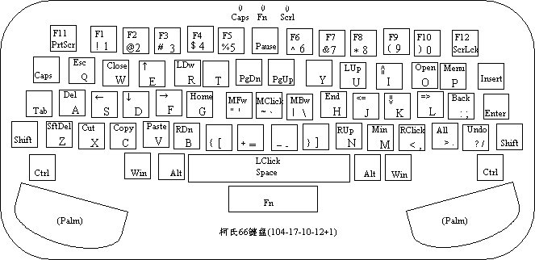
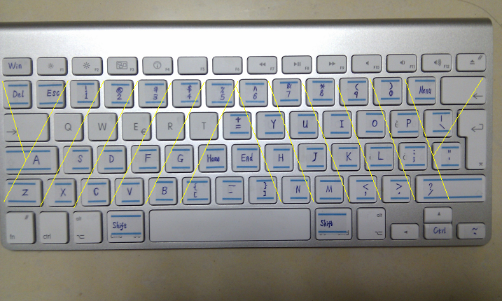
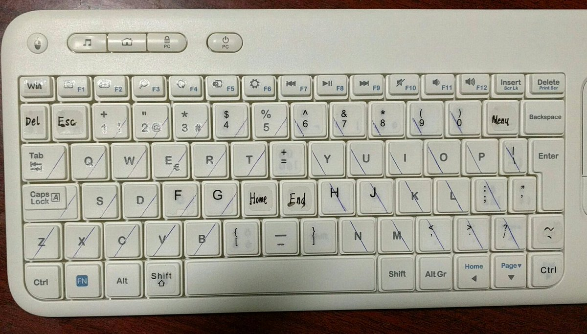

# MyBoard
MyBoard is a set of keyboard shortcut mapping,  
to control mouse movement, arrow keys, and keyboard shortcuts  with single keypress on alphabet area of keyboard, 
similar to vi editor, but on the system base.

There are 3 parts:

1. modify xkb define:

        usr_share_X11_xkb_symbols_inet.ekc1    for asus ekc1 keyboard
        usr_share_X11_xkb_symbols_inet.g6        for apple g6 european keyboard
        usr_share_X11_xkb_symbols_inet.k400r      for logitech k400r enropean keybaord

2. modify xserver and gtk:

        modify_xserver_and_gtk.txt

3. python script based on python xlib:

        myboard.py

Shortcut features(swith on/off with Both of left Shift and right Shift keys):

Hacked apple g6 european:

Hacked logitech k400r european:

I've used myboard.py in ubuntu for daily coding work for more than 5 years since 2013.
