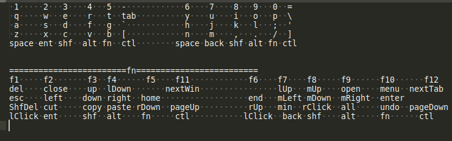

# MyBoard
MyBoard is a set of keyboard shortcut mapping,  
to control mouse movement, arrow keys, and keyboard shortcuts  with single keypress on alphabet area of keyboard, 
similar to vi editor, but on the linux system-wide.

https://diyism.github.io/MyBoard/index.htm

https://github.com/diyism/MyBoard

There are 3 steps to run:

1. modify linux xkb define of /usr/share/X11/xkb/symbols/inet:

        usr_share_X11_xkb_symbols_inet.ekc1    for asus ekc1 keyboard
        usr_share_X11_xkb_symbols_inet.g6        for apple g6 european keyboard
        usr_share_X11_xkb_symbols_inet.k400r      for logitech k400r european keybaord
        usr_share_X11_xkb_symbols_inet.k400r_for_armbian_waydroid     for logitech k400r european keybaord on armbian+waydroid

   "apt install xkb-data" will overwrite /usr/share/X11/xkb/symbols/inet, and the key mapping won't work in google idx monaco editor,
   a better method is to define /etc/udev/hwdb.d/10-myboard.hwdb:

        sudo cp etc_udev_hwdbd_10-myboard.hwdb /etc/udev/hwdb.d/10-myboard.hwdb

3. modify xserver and gtk:

        modify_xserver_and_gtk.txt

4. run python script based on python xlib:

        python3 myboard.py

Shortcut features(swith on/off with Both of left Shift and right Shift keys):

Hacked apple g6 european:

Hacked logitech k400r european:

Single handed blind touch keyboard:

30 keys single handed keyboard:

single handed keyboard by android touch and accelerometer(4fingers3strings.txt):

Hacked logitech k400r european B version:

I've used myboard.py in ubuntu for daily coding work for more than 10 years since 2013.
